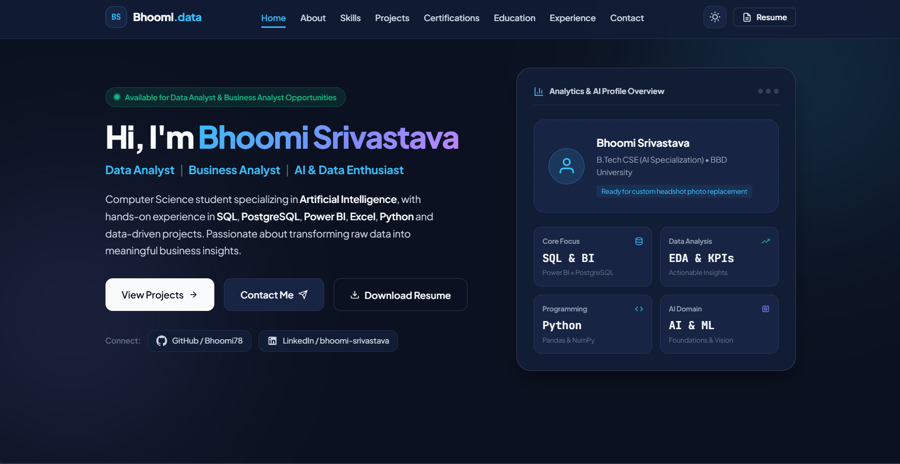

# 🌐 Bhoomi Srivastava — Personal Portfolio

Welcome to my personal portfolio website! 👋

This portfolio showcases my skills, projects, resume, and professional profile. It features a clean, modern, and responsive design that works across desktop, tablet, and mobile devices.

## ✨ Features

- 🎨 Modern and responsive portfolio design
- 👩‍💻 Personal introduction and professional profile
- 🛠️ Skills and technologies section
- 🚀 Projects showcase
- 📄 Resume download
- 📱 Mobile-friendly responsive layout
- ⚡ Interactive JavaScript elements
- 🌌 Modern visual effects and animations
- 🏠 Professional landing page
- 📸 Portfolio screenshots
- 🔗 Social and professional profile links
- 📬 Contact and connection options

## 🛠️ Technologies Used

- HTML5
- CSS3
- JavaScript
- Google Fonts

## 📁 Project Structure

```text
bhoomi-portfolio/
│
├── assets/
│   ├── Bhoomi_Srivastava_Resume.pdf
│   └── portfolio-screenshot.png
│
├── scripts/
│   ├── main.js
│   ├── projects-data.js
│   └── jarvis-simulator.js
│
├── styles/
│   ├── main.css
│   ├── components.css
│   └── responsive.css
│
├── index.html
└── README.md
```

## 🏠 Landing Page

The landing page is the first section visitors see when they open my portfolio.

It provides a quick introduction about me and my professional profile, along with easy navigation to explore my skills, projects, resume, and contact information.

### Landing Page Includes

- 👋 Personal introduction
- 💼 Professional profile
- 🚀 Call-to-action buttons
- 📄 Resume access
- 🔗 Social and professional links
- 🧭 Easy navigation
- 📱 Responsive design for desktop, tablet, and mobile devices


## 📸 Screenshots

### Portfolio Website



## 🚀 How to Run

Follow these steps to run the portfolio locally.

### 1. Clone the Repository

```bash
git clone https://github.com/Bhoomi78/bhoomi-portfolio.git
```

### 2. Open the Project

Open the `bhoomi-portfolio` folder in **VS Code**.

1. Open **VS Code**
2. Go to **File → Open Folder**
3. Select the `bhoomi-portfolio` folder
4. Click **Select Folder**

### 3. Run With Live Server

Install the **Live Server** extension in VS Code.

Then:

1. Open `index.html`
2. Right-click on `index.html`
3. Select **Open with Live Server**
4. The portfolio will open in your browser

## 📄 Resume

My resume is included in the `assets` folder.

You can view or download my resume directly from the portfolio website through the **Resume** section.

## 🌐 Live Portfolio

🔗 **View My Portfolio:** [Portfolio Website](YOUR_PORTFOLIO_URL)

The live portfolio link allows anyone to access my website from any device without needing to run the project locally.

## 📌 Project Purpose

This portfolio was created to build my professional online presence and showcase my technical skills, projects, resume, and professional profile in one place.

It provides an easy way for recruiters, employers, and other professionals to learn more about my skills and work.

## 🔗 Connect With Me

- 💼 **LinkedIn:** [Bhoomi Srivastava](https://www.linkedin.com/in/bhoomi-srivastava-68a0b929a)
- 💻 **GitHub:** [Bhoomi Srivastava](https://github.com/Bhoomi78)
- 🌐 **Portfolio:** [View My Portfolio](YOUR_PORTFOLIO_URL)

## 👩‍💻 Author

**Bhoomi Srivastava**

Aspiring software developer passionate about learning new technologies, building projects, and improving my technical skills.
